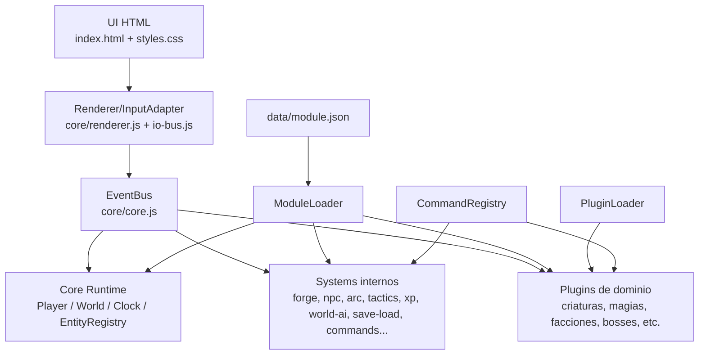
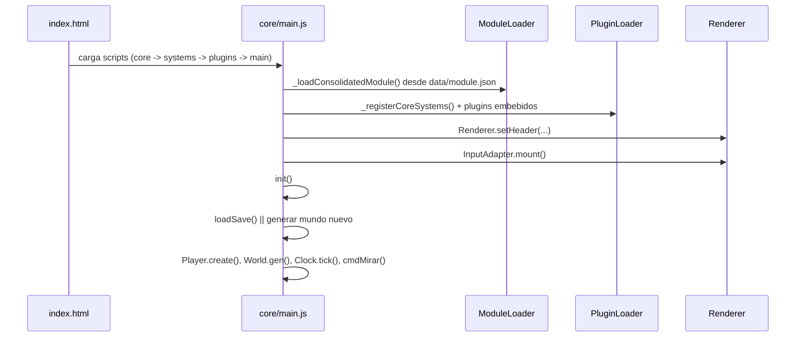
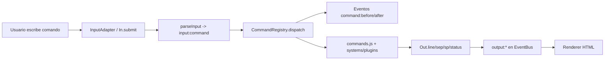
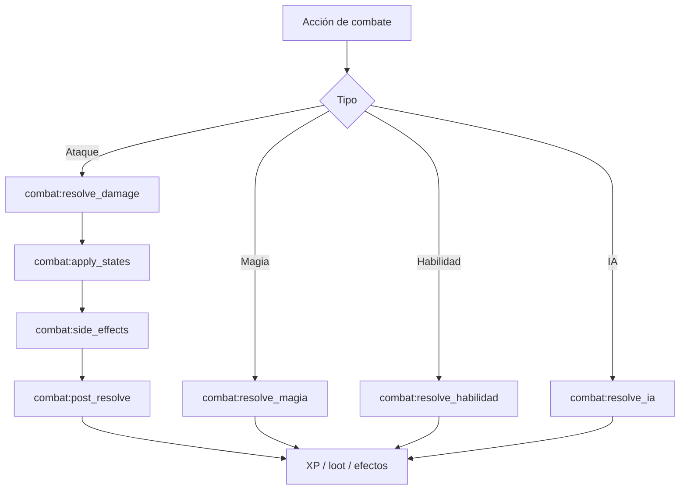

# ECOSISTEMA v2.1 (arquitectura actual)
### Motor RPG de texto modular, orientado a eventos y extensiones

> Este README fue actualizado tras un análisis del código real cargado por `index.html` y el bootstrap en `core/main.js`.

---

## 1) Resumen ejecutivo

ECOSISTEMA está organizado como un **runtime client-only** (sin backend) con cuatro ejes:

1. **Core desacoplado**: contratos de eventos, estado base y loaders.
2. **Systems internos**: lógica transversal (forja, narrativa, IA global, audio, guardado, comandos).
3. **Plugins de dominio**: reglas especializadas (criaturas, facciones, bosses, invocaciones, etc.).
4. **Datos consolidados**: `data/module.json` como fuente declarativa principal.

El patrón dominante es **Event-Driven Architecture (EDA)**: casi toda interacción entre subsistemas pasa por `EventBus`.

---

## 2) Inventario real del proyecto

### 2.1 Capas cargadas en runtime

- **Core cargado por `index.html`**: `core.js`, `entity.js`, `player.js`, `world.js`, `combat-resolution.js`, `io-bus.js`, `renderer.js`.
- **Systems internos**: 14 archivos bajo `systems/`.
- **Plugins de dominio**: 15 archivos bajo `plugins/`.
- **Boot**: `core/main.js` (define CTX, registra eventos, ejecuta `bootSeq()` e `init()`).
- **Datos**: `data/module.json` (estructura `meta`, `module`, `plugins`, `systems`).

> Nota: `core/utils.js` existe pero no forma parte del orden de carga de `index.html` actual.

### 2.2 Mapa de archivos

#### Core
- `core/core.js`: utilidades `U`, `EventBus`, `ModuleLoader`, `PluginLoader`, `CommandRegistry`, `ServiceRegistry`.
- `core/entity.js`: `Entity` base + `EntityRegistry` (fábricas por tipo).
- `core/player.js`: estado del jugador y cálculo de stats/eventos de jugador.
- `core/world.js`: `Clock`, `World` y `GS` (estado narrativo/misiones/NPCs, etc.).
- `core/combat-resolution.js`: pipelines de resolución (`attack`, `magia`, `habilidad`, `ia`).
- `core/io-bus.js`: contratos `Out`/`In` por eventos (`output:*`, `input:*`).
- `core/renderer.js`: único adaptador DOM oficial (render de terminal HTML).
- `core/main.js`: wiring global, validación de eventos, boot e init.

#### Systems (`systems/`)
- `run-memory.js`: memoria entre runs (histórico/ecos).
- `forge.js`: sistema de forja, tensión e improntas.
- `npc-engine.js`: generación/interacción de NPCs, misiones y giros.
- `arc-engine.js`: arcos narrativos multiacto y consecuencias.
- `tactics.js`: cálculo táctico de combate (clima, superficies, reacciones).
- `item-system.js`: uso de ítems/efectos y reglas de inventario.
- `xp.js`: ramas de experiencia, niveles y asignación de atributos.
- `world-ai.js`: migración de entidades y comportamiento global del mundo.
- `music.js`: capa de música por eventos.
- `sfx.js`: efectos de sonido por eventos.
- `net.js`: sincronización/IO de red opcional.
- `save-load.js`: persistencia local (`localStorage`) de sesión/partida.
- `commands.js`: parser-dispatch y comandos jugables.
- `autocomplete.js`: autocompletado contextual del input.

#### Plugins (`plugins/`)
- `plugin-criaturas.js`
- `plugin-habilidades.js`
- `plugin-magias.js`
- `plugin-ia-batalla.js`
- `plugin-facciones.js`
- `plugin-bosses.js`
- `plugin-tricksters.js`
- `plugin-sombra-herrante.js`
- `plugin-arbol-vida.js`
- `plugin-transformaciones.js`
- `plugin-guarida.js`
- `plugin-invocaciones.js`
- `plugin-reino-pesadilla.js`
- `plugin-cultos.js`
- `plugin-concentracion.js`

---

## 3) Arquitectura (visión de alto nivel)



### Lectura de la arquitectura
- **Core** define contratos y ciclo de juego, no “contenido de fantasía”.
- **Systems** orquestan capacidades base del runtime.
- **Plugins** inyectan verticales de gameplay sin hard-couple directo.
- **ModuleLoader** permite reconfigurar comportamiento por datos.

---

## 4) Secuencia de arranque real



Puntos relevantes:
- Si existe save válido, se restaura sesión antes de generar mundo nuevo.
- Si falla `data/module.json`, hay fallback de módulo base.
- El boot visual usa `Out.boot(...)` y no escritura directa en DOM fuera del renderer.

---

## 5) Contratos clave por eventos

### 5.1 EventBus como backbone
El `EventBus` en `core/core.js` soporta:
- `on`, `once`, `off`, `emit`, `emitCancellable`.
- prioridades/fases (`pre`, `main`, `post`, `observe`).
- validación de payload in/out por especificación de evento.
- trazas, historial y health por plugin/listener (timings, errores, timeouts).

### 5.2 Tipos de eventos que gobiernan el runtime
- **Input/Output**: `input:*`, `output:*`.
- **Mundo**: `world:*`, `entity:*`, `faction:*`, `boss:*`.
- **Jugador**: `player:*`, `memory:*`.
- **Combate**: `combat:*` (incluyendo pipelines resolubles por plugins).
- **Narrativa**: `narrative:*`, `arc:*`.
- **Control/Integración**: `command:*`, `module:*`, `plugin:*`, `audio:*`.

---

## 6) Pipeline de comando y salida



Claves de diseño:
- El motor escribe por `Out.*`; el render real lo decide el adaptador.
- `commands.js` centraliza UX textual, delegando capacidades especializadas a systems/plugins.

---

## 7) Pipeline de combate actual



Este pipeline permite que plugins (magias/habilidades/IA/tácticas) cambien resolución sin reescribir el core.

---

## 8) Estado, persistencia y memoria

- **Estado vivo**: `Player`, `World`, `Clock`, `GS`.
- **Persistencia inmediata**: `save-load.js` (incluye hooks de guardado/carga).
- **Memoria meta-run**: `run-memory.js` y plugins como `sombra-herrante` reutilizan runs previas.
- **Datos de equilibrio/configuración**: `data/module.json` + overrides via `ModuleLoader.get(...)`.

---

## 9) Evaluación técnica (fortalezas y riesgos)

### Fortalezas
- Aislamiento UI/lógica por IO Bus + renderer único.
- Extensibilidad muy alta mediante `PluginLoader` y contratos de eventos.
- Bootstrap robusto con fallback de módulo y validación de eventos.
- Buen soporte para sistemas complejos sin acoplamiento directo (combate, narrativa, IA).

### Riesgos / deuda técnica observada
- Alta densidad de lógica en algunos archivos grandes (ej. `commands.js`, `forge.js`).
- Existencia de archivos legacy/no usados en carga actual (`core/utils.js`).
- Superposición potencial entre lógica en systems y plugins cuando crece el ecosistema.
- **Rupturas puntuales del patrón EDA**: comandos y plugins críticos todavía invocan globals (`Net`, `XP`, `Tactics`, `RunMem`) de forma directa en vez de pasar siempre por `EventBus`/`ServiceRegistry`.

### Recomendaciones de evolución
1. Dividir `commands.js` por dominios (movimiento/combate/narrativa/crafting).
2. Documentar catálogo de eventos en una spec versionada separada (`docs/events.md`).
3. Añadir smoke tests por plugin crítico (actualmente hay smoke general).
4. Formalizar compatibilidad de plugins por semver + contrato de evento.

**Estado DoD actual (auditoría unificada):** ⚠️ Parcial (2/4 cumplidos, 1 parcial, 1 pendiente).

> Ver resultados consolidados en `docs/eda-audit.md` (auditoría EDA completa, validación DoD, roadmap y aplicación metodológica del Sprint 9), contrato de eventos en `docs/events.md` y metodología reusable en `SprintAgenticSkill.md`.

---

## 10) Testing y utilidades incluidas

- `npm test` ejecuta:
  - `tests/runtime_smoke.js`
  - `tests/autocomplete_precedence_smoke.js`
  - `tests/plugins_critical_smoke.js`
  - `tests/plugins_battle_services_smoke.js`
  - `tests/plugins_memory_services_smoke.js`
  - `tests/runtime_memory_services_smoke.js`
  - `tests/architecture_guard_smoke.js`
  - `tests/events_contract_smoke.js`
  - `tests/ownership_matrix_smoke.js`
- Existe adicionalmente `tests/e2e_8runs_smoke.js` para corridas prolongadas.

---

## 11) Ejecución rápida

1. Abrir `index.html` en navegador moderno.
2. Para pruebas en Node:
   ```bash
   npm test
   ```
3. Si quieres reset de progreso: limpiar `localStorage` de la clave del juego desde el navegador.

---

## 12) Archivos de soporte visual/documental

- `arquitectura.html`: visualización complementaria de arquitectura.
- `module-builder.html`: herramienta para construir módulos/plugins declarativos.
- `samples/`: ejemplos de audio (`music_samples.html`, `sample_sfx.html`).

